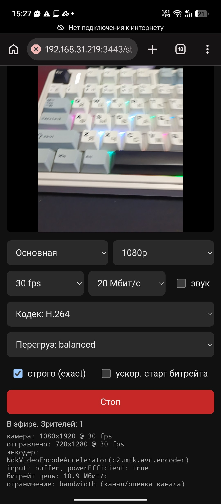
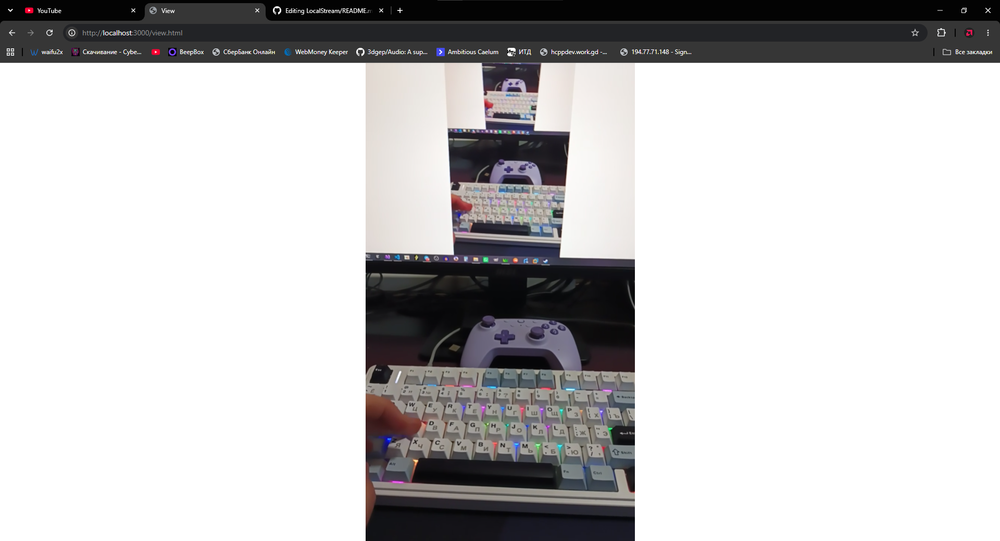

# local-stream

Локальная трансляция камеры телефона в браузер или OBS по WebRTC. Node.js + чистый JS, без облаков.

Телефон шлёт видео напрямую на страницу просмотра, сервер нужен только чтобы их соединить.

```
телефон (stream.html)  ──WebRTC──▶  ПК (view.html / OBS)
            └──── WebSocket ────▶ server.js ◀────┘
```

## Скриншоты
Телефон


ПК


Нужен [Node.js](https://nodejs.org) 18+.

```
npm install
npm start
```

В консоли появятся ссылки:

| Где | Ссылка |
|---|---|
| Телефон (трансляция) | `https://<IP-ПК>:3443/stream.html` |
| ПК / OBS (просмотр) | `http://localhost:3000/view.html` |

Телефон и ПК должны быть в одной сети.

## Использование

1. Открой `stream.html` на телефоне и разреши доступ к камере.
2. Выбери камеру, разрешение, fps, битрейт и нажми **Старт**.
3. Открой `view.html` на ПК или добавь в OBS: **Источник → Браузер**, URL `http://localhost:3000/view.html`.

Порядок не важен: страницы подключаются сами, когда появится вторая сторона.

### Параметры view.html

| Параметр | Что делает |
|---|---|
| `?mute=1` | без звука |
| `?debug=1` | показать статус подключения |
| `?fit=cover` | заполнить кадр вместо вписывания |

Пример: `http://localhost:3000/view.html?mute=1&fit=cover`

Если нужен звук в OBS, включи в источнике «Управлять звуком через OBS».

## Настройки на телефоне

- **Кодек:** H.264, VP8, VP9, AV1 или авто. Если картинка плохая, попробуй другой.
- **Строго (exact):** камера должна дать именно выбранные параметры, иначе будет ошибка. Удобно для диагностики.
- **Ускоренный старт битрейта:** помогает, если картинка долго «мылится» в начале.
- **Перегруз:** что жертвовать при нехватке ресурсов: fps или разрешение.

Под кнопкой показывается живая статистика: что отдала камера, что реально отправлено, какой энкодер и что ограничивает качество (`cpu` или `bandwidth`).

## Частые проблемы

**Предупреждение о сертификате на телефоне.** Это нормально: камера работает только по HTTPS, поэтому сертификат самоподписанный. Нажми «Дополнительно» → «Продолжить». Сертификат создаётся сам при первом запуске в папке `cert/`.

**Телефон не открывает страницу.** Проверь, что вы в одной сети, и разреши Node.js в брандмауэре Windows (частная сеть).

**Not found.** Файлы `stream.html` и `view.html` должны лежать в папке `public/` (или рядом с `server.js`).

**В OBS не открывается.** Используй `http://localhost:3000`, а не https.

**Размазанная картинка или низкий fps.** Смотри строки статистики на телефоне:
- `ограничение: cpu`: телефон не успевает кодировать, снизь разрешение или включи другой кодек;
- `ограничение: bandwidth`: проблема с сетью, лучше Wi-Fi 5 ГГц;
- `powerEfficient: false`: кодирование идёт программно.


## Структура

```
local-stream/
├── server.js        # HTTP/HTTPS + WebSocket сигналинг
├── package.json
└── public/
    ├── stream.html  # отправка с телефона
    └── view.html    # просмотр / OBS
```

## Лицензия

MIT
